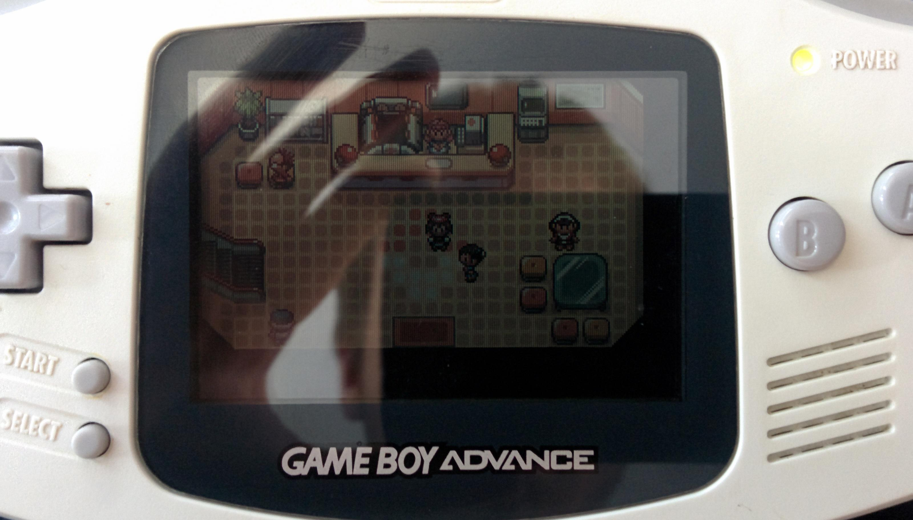
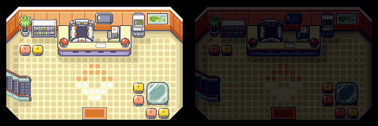
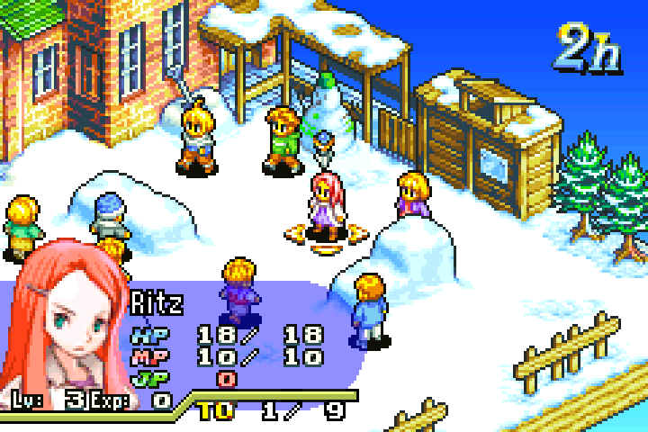
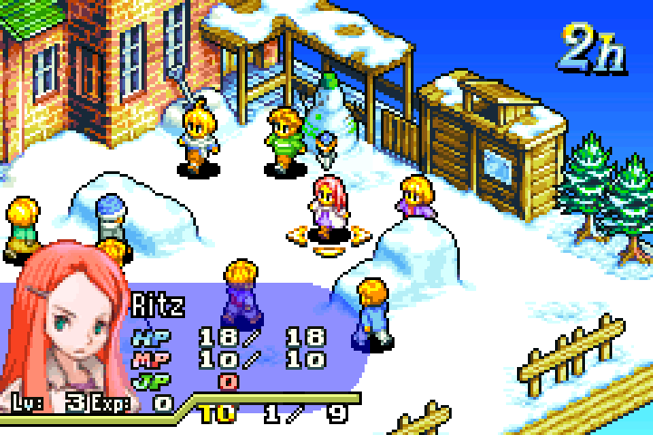
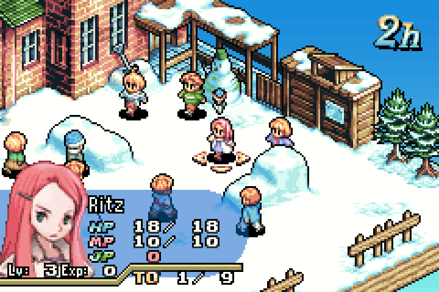
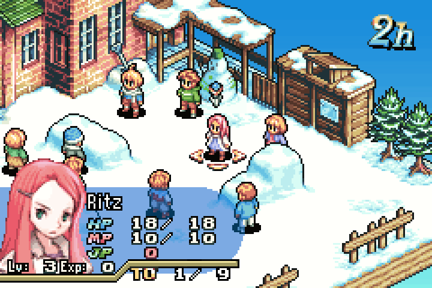
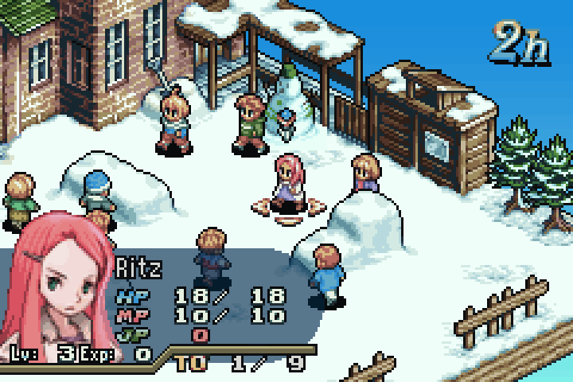
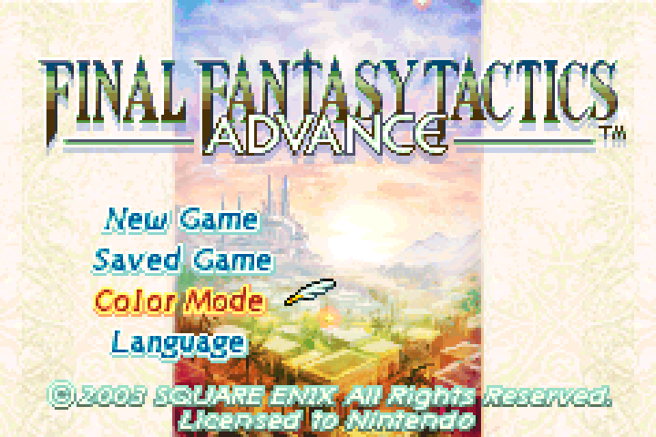
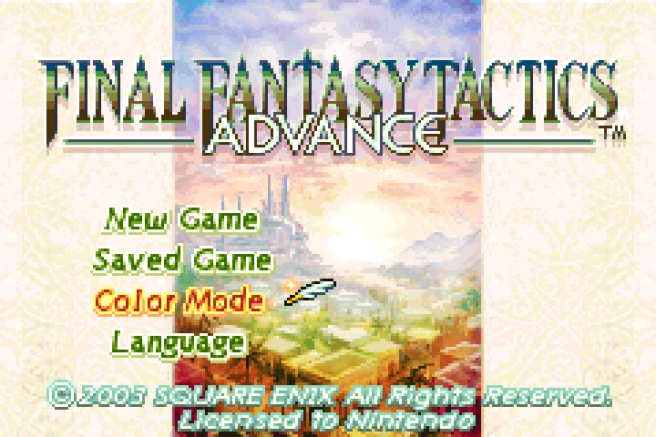

# Display

## Geometry

240 horizontal pixels, by 160 vertical pixels. 240x160. This was marketed as "wide screen", with a 3:2 aspect ratio. Compared to modern displays, it isn't THAT wide, but compared to the DMG/CGB's 160x144 display (10:9) it is wider.

On the original GBA models; the display's individual pixels are made up of blue, green, and red components. This is called BGR pixel arrangement.

Knowing the pixel arrangement lets you do some cool sub-pixel anti-aliasing, but hold your horses on that idea: GBA games can also be played on televisions via the Game Boy Player, and these days you can play GBA games on all sorts of devices on all kinds of displays, so you can't depend on a BGR pixel arrangement.

> Trivia: Whilst the top screen of the Nintendo DS has BGR pixel arrangement, the bottom screen has RGB pixel arrangement.

## Colour Depth

The LCD displays 15 bits-per-pixel (bpp), 5-bits for blue, 5-bits for green, 5-bits for red. I'll refer to this as BGR555 for short. That makes for 32,768 total colours. Wow!

In comparison, a typical PC display displays 24-bpp, RGB888 (8-bits for red, green, and blue).

Whilst the display can only show 15-bpp, the Picture Processor Unit (PPU) handles colours in 16-bits, with the top-most bit unused (or is it unused? More on this later...).

## Display Gamma

Ah, nothing like trying to play Game Boy late at night on the backseat of the family car during a long-drive, with only the amber of the passing street lights there to let you see what the heck is happening in your game.

We've been spoiled in modern times.

### What is "Display Gamma"?

[We actually perceive colour non-linearly](https://en.wikipedia.org/wiki/Lightness), so if we use a linear colour scale, where 50% grey is exactly 50:50 mix of black and white, our eyes will perceive that there are more light shades, than dark shades.

<table>
<tr>
<td>&nbsp;</td><td>0</td><td>1</td><td>2</td><td>3</td><td>4</td><td>5</td><td>6</td><td>7</td><td>8</td><td>9</td><td>X</td>
</tr>
<tr>
<td>sRGB</td>
<td style="background: #000000;"/>
<td style="background: #1a1a1a;"/><td style="background: #333333;"/><td style="background: #4d4d4d;"/><td style="background: #666666;"/>
<td style="background: #808080;"/><td style="background: #999999;"/><td style="background: #b3b3b3;"/><td style="background: #cccccc;"/>
<td style="background: #e6e6e6;"/><td style="background: #ffffff;"/>
</tr>
<tr>
<td>Linear</td>
<td style="background: #000000;"/>
<td style="background: #5a5a5a;"/><td style="background: #7b7b7b;"/><td style="background: #949494;"/><td style="background: #a9a9a9;"/>
<td style="background: #bbbbbb;"/><td style="background: #cbcbcb;"/><td style="background: #d9d9d9;"/><td style="background: #e7e7e7;"/>
<td style="background: #f4f4f4;"/><td style="background: #ffffff;"/>
</tr>
</table>

You're likely viewing this document on an sRGB display, so the sRGB column should look like a smooth gradient (if it doesn't, perhaps calibrate your display).    
The bottom row is the same gradient, converted to linear colour space (where 50% is 50:50 grey). I have no way of proving this, because we're all on sRGB displays (plus, sRGB is the standard for web rendering), but trust me it is converted to linear. Notice how this gradient brightens quite rapidly in contrast.

[sRGB is a colour standard](https://en.wikipedia.org/wiki/SRGB) for displays on PC monitors that has become ubiquitous. sRGB assumes a gamma of 2.2, which means (in very rough terms) all linear colour is raised to a power of 2.2 to produce the perception of linear colour on our displays.

> Trivia: Gamma is the third letter of the Greek alphabet, and its lower-case character is: γ which is probably why the GBA register for brightness is named "Blend Y" with the Latin letter "Y" resembling gamma.

### What is the GBA's display "Gamma"?

There's a cute way to figure out a display's gamma: use a dithering of pure black and white pixels to create a gradient, this dithering results in a perceptual linear gradient. If this is displayed along side a real gradient you can sort of estimate the distance between the two 50% greys of both gradients. If they're both bang in the middle (unlikely) then you've got a gamma of 1.

[Damian "PinoBatch" Yerrick](https://twitter.com/PinoBatch) estimates the GBA's gamma to be [somewhere between 3 and 4](https://pineight.com/gba/#static). What does that mean? It means the GBA's display is freaking DARK.    
[teryor](https://www.blogger.com/profile/09825626907766471207) also conducted [their own experiments](http://codewitchgamedev.blogspot.com/2015/08/emulating-gbas-display-with-gamma.html) and estimates the gamma for the individual RGB channels to be 4.0, 3.0, and 1.4 (so blue should be a bit more perceivable).

|||
|---|---|
|Photo by [teryor](https://www.blogger.com/profile/09825626907766471207)|Tilemap adjustment by [teryor](https://www.blogger.com/profile/09825626907766471207)|

How on earth did we ever see ANYTHING on this device? Well, as a child you didn't really care because it's still a GBA, the most powerful hand-held games console (at the time).

Also we all had these weird over-head light accessories that shone an annoying blob of light right at the middle of the screen, so you had to constantly angle the device as you played to see what you're doing.

The AGS-101 (backlit SP), Game Boy Player, Micro, and onwards all assume a display closer to that of an LCD TV (which we can assume has a gamma of 2.2, an sRGB PC display).

### But wait, there's more!

On the History page I mentioned that the frontlit AGS-001 (first model of SP) has a "slightly bluish hue" to its light? Well, now not only is the screen is more visible (gamma is still a little dark), but it's also a bit blue.

## Optimising for various displays

Final Fantasy Tactics Advance provides 3 colour palettes named "LCD A", "LCD B", and "TV". Each of these palettes attempt to adjust for the various GBA displays.

Below I have the game running in the [mGBA emulator](https://mgba.io/) showing each display palette and comparing against mGBA with its built-in AGB shader (designed to mimic the colour profile of the AGB, but luckily not the darkness).

||mGBA|AGB shader|
|---|---|---|
|LCD A (AGB-001)|||
|LCD B (AGS-001)|||
|TV (DOL-017)|||

It is very likely that the lower-left is the artist-intended vision for the game, with the sprites and artwork possibly calibrated on an sRGB PC display monitor.

The top-left is likely how most people are playing the game in emulator today, as it is the default palette and most people typically don't think to explore the options screen of most video games. See how yellow the characters are in the top left versus the bottom left.

Interestingly, "LCD B" on the right looks similar to "TV" on the left.

Calculating the colour difference between "LCD A" and "LCD B" reveals that it's mostly a contrast change ("LCD B" has darker outlines), but I did notice that for the title screen it reduces the strength of the blue hues, leading me to believe "LCD B" is intended for the rather blue-ish, slightly low-contrast, AGS-001 front-light.

|Title screen LCD A|Title screen LCD B|
|---|---|
|||
