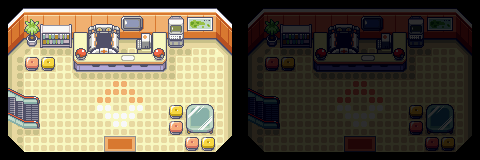
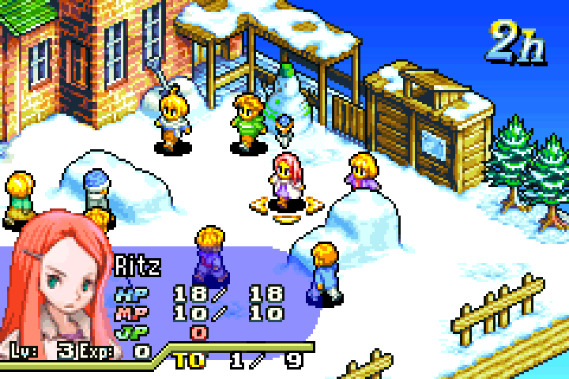
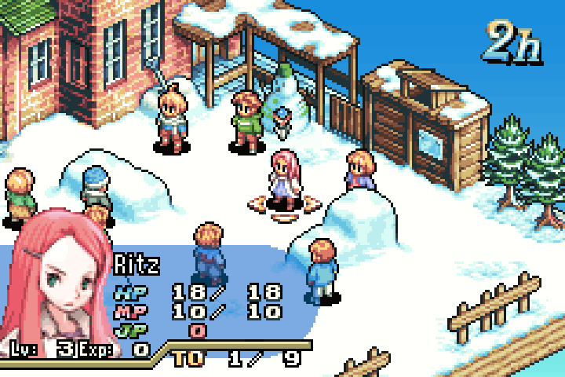

As said in the previous page, the GBA has a completely different machine architecture to the DMG/CGB.

# The architecture

The GBA was marketed as having a powerful 32-bit **RISC** processor. What does RISC mean? It stands for Reduce Instruction Set Computer. What does that mean? These days: not a lot.

## ARMv4t / ARM7TDMI

The actual processor architecture used in the GBA is the ARM7TDMI. Supposedly the 7th generation of ARM's architecture (hence ARM7). Who is ARM? Advanced RISC Machines.

What does TDMI stand for? Well that stands for:
* 16-bit **T**humb instruction set support
* The letter **D**
* Hardware **M**ultiplication support
* The letter **I**

The primary instruction set for ARM7 is ARMv4 (the forth version of the ARM instruction set!), but because we have support for Thumb instructions the complete instruction set is ARMv4t. The naming convention is a little confusing.

From here on these two instruction sets will be stylised as: thumb and ARM.

> Theory trivia: The reason Nintendo used "RISC processor" in their marketing and not "ARM processor" could be because they didn't have a license to use ARM's trademark.

### Instruction sets

This is actually super important for GBA stuff. The ARM7TDMI has fixed-length instructions. ARM instructions are 32-bit, thumb instructions are 16-bit.

The GBA is a 32-bit console, it will boot up reading 32-bit instructions to execute on its 32-bit CPU. But the bus to the cartridge is 16-bit! Which means all 32-bit reads will take two reads. That's not good for performance\*. Also: 32-bits is a lot of bits taking up a lot of space, and the ROM chips on these cartridges cost money.

The smaller 16-bit thumb instructions can be read from the cartridge in 1, the instructions are also much more dense in terms of bit storage, which (in theory) means smaller games, which means smaller ROM chips, so money saved.

> Trivia: There is a reason why 16-bit thumb is so ideal for cheap cartridges on a 16-bit bus, and that's because ARM originally designed thumb with Nintendo and their cartridge consoles in mind. The ARM7TDMI itself (and the thumb instruction set) was published in 1994, some 7 years before the GBA's release date!

### Clock Speed

The CPU runs at 2^24 cycles/second, which is 16.777216 megahertz (MHz). Some instructions take multiple cycles to execute, and some memory accesses take multiple cycles to complete.

## Random Access Memories

But first: a bit about notation.

|IEC name|Traditional name|Quantity  |IEC symbol|LD symbol|
|--------|----------------|----------|----------|---------|
|Byte    |Byte            |8 bits    |B         |-        |
|Kibibyte|Kilobyte        |1024 Bytes|KiB       |K        |
|Mebibyte|Megabyte        |1024 KiB  |MiB       |M        |

When required, we'll use the 1998 IEC names and symbols as it avoids ambiguity. The LD symbols are used in linker scripts, which will be important later.

### Internal RAM

But isn't all the RAM internal? Well yes, but this is "internal" from the perspective of the CPU.

The internal RAM is on the same physical package as the CPU.

#### 32KiB Internal Work RAM

IWRAM for short. This is fast RAM on a 32-bit bus: perfect for fast, optimised ARM instructions and stack memory.

#### 96KiB Video RAM

VRAM for short. This is where all the background and sprite graphics will live. You can only access this memory in units of 16-bits, so to write a single byte you have to first read 16-bits, modify the byte you're interested in, then write back 16-bits. Watch out for that.

#### 1KiB Palette RAM

PRAM? CRAM for colour RAM? There's no general short term for this RAM, so we'll just call it Palette RAM. This holds two palettes of 256 colours (Colours are 16-bit). One palette is used for background graphics, the other is used for sprite graphics.

> Trivia: Yes the author is British. I will use the spelling "colour" for any written text, and "color" for any code. Did you notice how I spelled "optimised" above?

#### 1KiB Object Attribute Memory

OAM for short. This stores everything related to setting the up hardware sprites for display.

### External RAM

External from the CPU package, this RAM is still on the motherboard in its own little chip.

256KiB on a 16-bit bus. 32-bit accesses are automatically converted to two 16-bit access. Traditionally this is where the heap is placed for big allocations (because we have soooo much space with 256KiB). This is slower than IWRAM, and being 16-bits makes this more ideal for thumb instructions, rather than ARM instructions.

### Save RAM

SRAM for short. This isn't actually part of the console, it resides in the game pak (the cartridge). This is only available on cartridges with an RAM chip on board. 8-bit accesses only and the hardware does nothing to help if you want to access 16 or 32 bits.

It's also very slow. It's intended for saving data, like a save file or something.

Maxes out at 64KiB, but 32KiB is what you usually find out in the wild.

## Game Paks

AKA: the cartridge, and the ROM. The maximum addressable size is 32MiB, however 64MiB cartridges do exist (those weird GBA video cartridges are such examples), and these achieve greater capacity through bank switching.

Some cartridges have additional hardware on them, such as a real-time clock, a vibration motor, a tilt sensor, a freaking analogue TV tuner, and a crazy card-scanning accessory.

## Display

### Geometry

240 horizontal pixels, by 160 vertical pixels. 240x160. This was marketed as "wide screen", with a 3:2 aspect ratio. Compared to modern displays, this isn't THAT wide, but compared to the DMG/CGB's 160x144 display (10:9) it is wider.

On the original GBA models; the display's individual pixels are made up of blue, green, and red components. This is called BGR pixel arrangement.

Knowing the pixel arrangement lets you do some cool sub-pixel anti-aliasing, but hold your horses on that idea: GBA games can also be played on televisions via the Game Boy Player, and these days you can play GBA games on all sorts of devices on all kinds of displays, so you can't depend on a BGR pixel arrangement.

> Trivia: Whilst the top screen of the Nintendo DS has BGR pixel arrangement, the bottom screen has RGB pixel arrangement.

### Colour Depth

#### Display colour depth

The LCD displays 15 bits-per-pixel (bpp), 5-bits for blue, 5-bits for green, 5-bits for red. I'll refer to this as BGR555 for short. That makes for 32,768 total colours. Wow!

In comparison, a typical PC display displays 24-bpp, RGB888 (8-bits for red, green, and blue).

Whilst the display can only show 15-bpp, the Picture Processor Unit (PPU, more on this later) handles colours in 16-bits. More on this later.

### Display Gamma

Ah, nothing like trying to play Game Boy late at night on the backseat of the family car during a long-drive, with only the amber of the passing street lights there to let you see what the heck is happening in your game.

We've been spoiled in modern times.

#### What is "Display Gamma"?

[We actually perceive colour non-linearly](https://en.wikipedia.org/wiki/Lightness), so if we use a linear colour scale, where 50% grey is exactly 50:50 mix of black and white, our eyes will perceive that there are more light shades, than dark shades.

<table>
<tr>
<td>&nbsp;</td><td>0</td><td>1</td><td>2</td><td>3</td><td>4</td><td>5</td><td>6</td><td>7</td><td>8</td><td>9</td><td>X</td>
</tr>
<tr>
<td>sRGB</td>
<td style="background: #000000;"/>
<td style="background: #1a1a1a;"/><td style="background: #333333;"/><td style="background: #4d4d4d;"/><td style="background: #666666;"/>
<td style="background: #808080;"/><td style="background: #999999;"/><td style="background: #b3b3b3;"/><td style="background: #cccccc;"/>
<td style="background: #e6e6e6;"/><td style="background: #ffffff;"/>
</tr>
<tr>
<td>Linear</td>
<td style="background: #000000;"/>
<td style="background: #5a5a5a;"/><td style="background: #7b7b7b;"/><td style="background: #949494;"/><td style="background: #a9a9a9;"/>
<td style="background: #bbbbbb;"/><td style="background: #cbcbcb;"/><td style="background: #d9d9d9;"/><td style="background: #e7e7e7;"/>
<td style="background: #f4f4f4;"/><td style="background: #ffffff;"/>
</tr>
</table>

You're likely viewing this document on an sRGB display, so the sRGB column should look like a smooth gradient (if it doesn't, perhaps calibrate your display).    
The bottom row is the same gradient, converted to linear colour space (where 50% is 50:50 grey). I have no way of proving this, because we're all on sRGB displays, but trust me it is converted to linear. Notice how this gradient brightens quite rapidly in contrast.

[sRGB is a colour standard](https://en.wikipedia.org/wiki/SRGB) for displays on PC monitors that has become ubiquitous. sRGB assumes a gamma of 2.2, which means (in very rough terms) all linear colour is raised to a power of 2.2 to produce the perception of linear colour on our displays.

> Trivia: Gamma is the third letter of the Greek alphabet, and its lower-case character is: γ which is probably why the GBA register for brightness is named "Blend Y" with the Latin letter "Y" resembling gamma.

#### What is the GBA's display "Gamma"?

There's a cute way to figure out a display's gamma: use a dithering of pure black and white pixels to create a gradient, this dithering results in a perceptual linear gradient. If this is displayed along side a real gradient you can sort of estimate the distance between the two 50% greys of both gradients. If they're both bang in the middle (unlikely) then you've got a gamma of 1.

[Damian "PinoBatch" Yerrick](https://twitter.com/PinoBatch) estimates the GBA's gamma to be [somewhere between 3 and 4](https://pineight.com/gba/#static). What does that mean? It means the GBA's display is freaking DARK.    
[teryor](https://www.blogger.com/profile/09825626907766471207) also conducted [their own experiments](http://codewitchgamedev.blogspot.com/2015/08/emulating-gbas-display-with-gamma.html) and estimates the gamma for the individual RGB channels to be 4.0, 3.0, and 1.4 (so blue should be a bit more perceivable).

|||
|---|---|
|Photo by [teryor](https://www.blogger.com/profile/09825626907766471207)|Tilemap adjustment by [teryor](https://www.blogger.com/profile/09825626907766471207)|

How on earth did we ever see ANYTHING on this device? Well, as a child you didn't really care because it's still a GBA, the most powerful hand-held games console (at the time).

Also we all had those were over-head light accessories that put an annoying ball of light in the middle of the screen, so you had to constantly angle the device as you played to see what you're doing.

The AGS-101 (backlit SP), Game Boy Player, Micro, and onwards all assume a display closer to that of an LCD TV (which we can assume has a gamma of 2.2, an sRGB PC display).

#### But wait, there's more!

On the previous page I mentioned that the frontlit AGS-001 (first model of SP) has a "slightly bluish hue" to its light? Well, now not only is the screen is more visible (gamma is still a little dark), but it's also a bit blue.

Final Fantasy Tactics Advance provides 3 colour palettes named "LCD A", "LCD B", and "TV". Each of these palettes attempt to adjust for various GBA displays.

Below I have the game running in the [mGBA emulator](https://mgba.io/) show each display palette and comparing with mGBA's AGB shader (designed to mimic the colour profile of the AGB, but luckily not the brightness).

||mGBA|AGB shader|
|---|---|---|
|LCD A (AGB-001)|||
|LCD B (AGS-001)|||
|TV (DOL-017)|||

It is very likely that the lower-left is the artist-intended vision for the game, with the sprites and artwork possibly calibrated on an sRGB PC display monitor.

The top-left is likely how most people are playing the game in emulator today, as it is the default palette and most people typically don't think to explore the options screen of most video games. See how yellow the characters are in the top left versus the bottom left.

Notice that "LCD A" and "LCD B" barely look any different on the left, but with the AGB shader on the right they look quite different indeed. Interstingly, "LCD B" on the right looks similar to "TV" on the left.

A colour difference between "LCD A" and "LCD B" shows that it's mostly a contrast change ("LCD B" has darker outlines), but I did notice that for the title screen and fonts it reduces the strength of the blue hues, leading me to believe "LCD B" is intended for rather blue-ish, not super-bright, AGS-001 frontlight.
