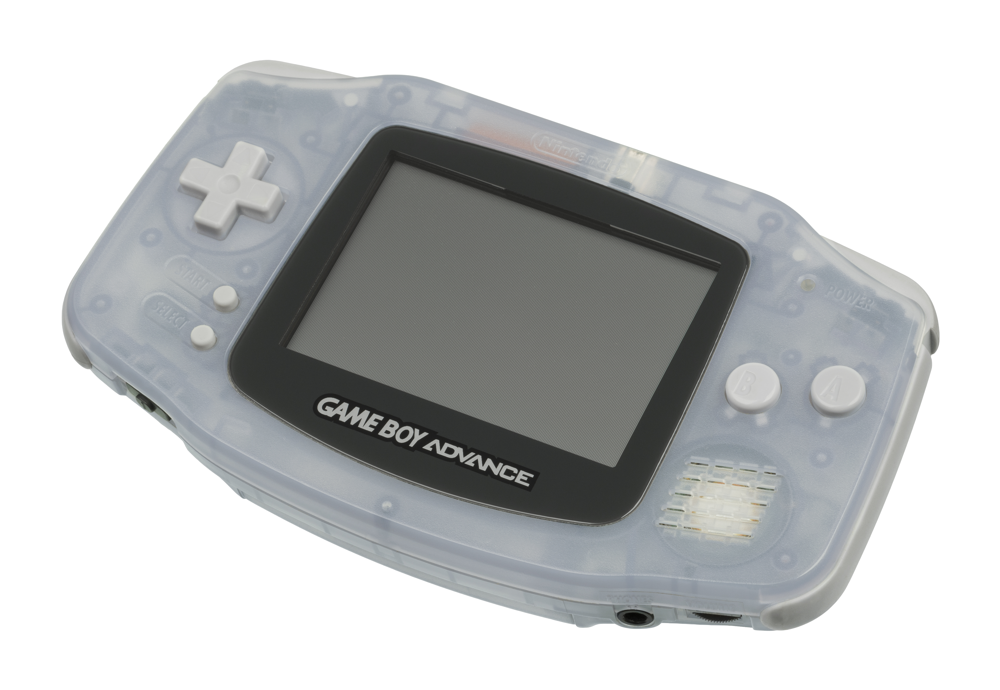
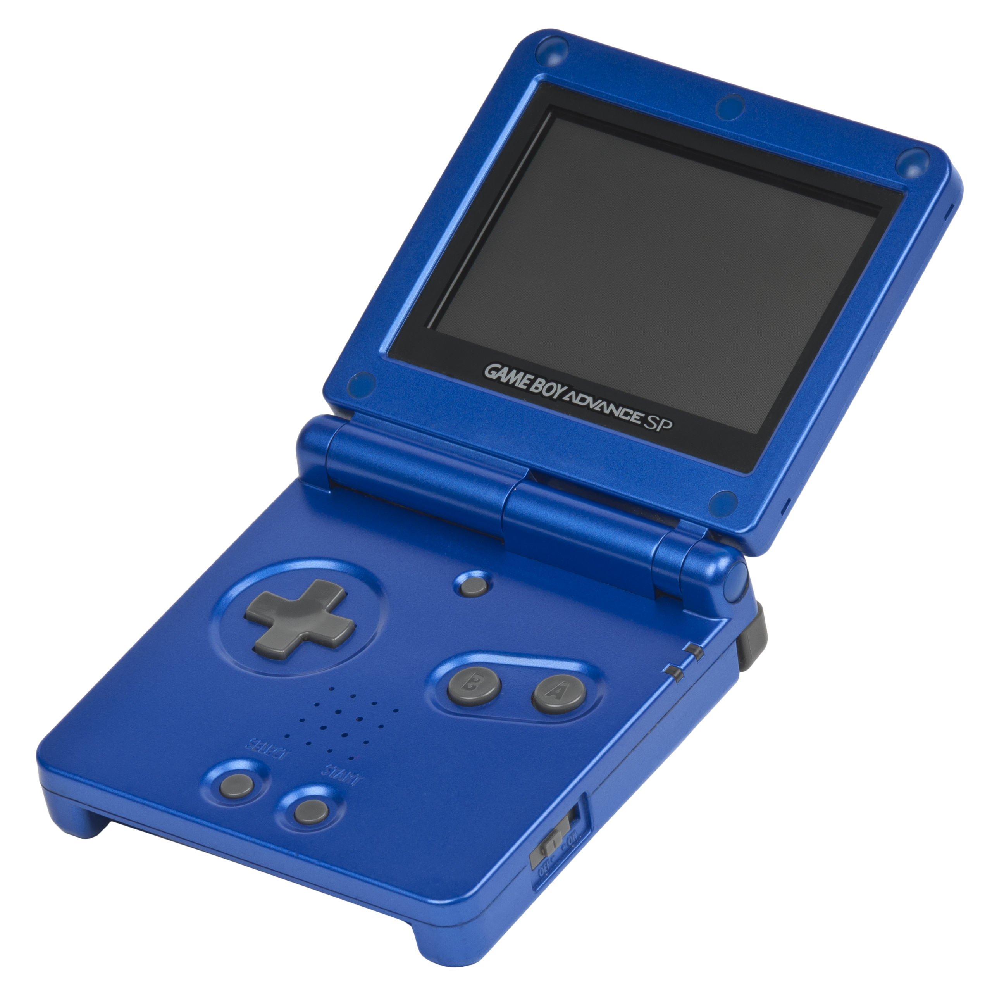
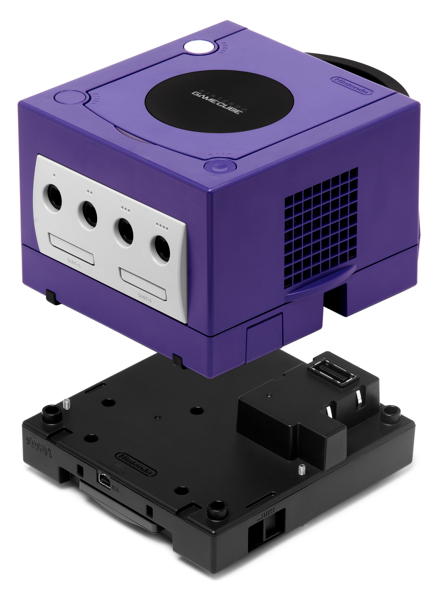
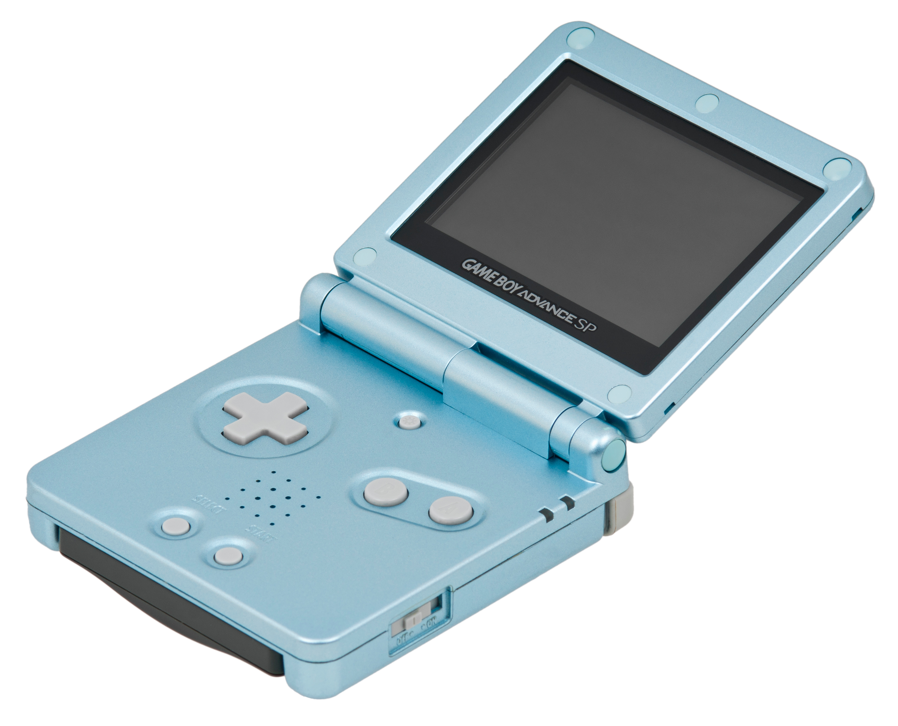
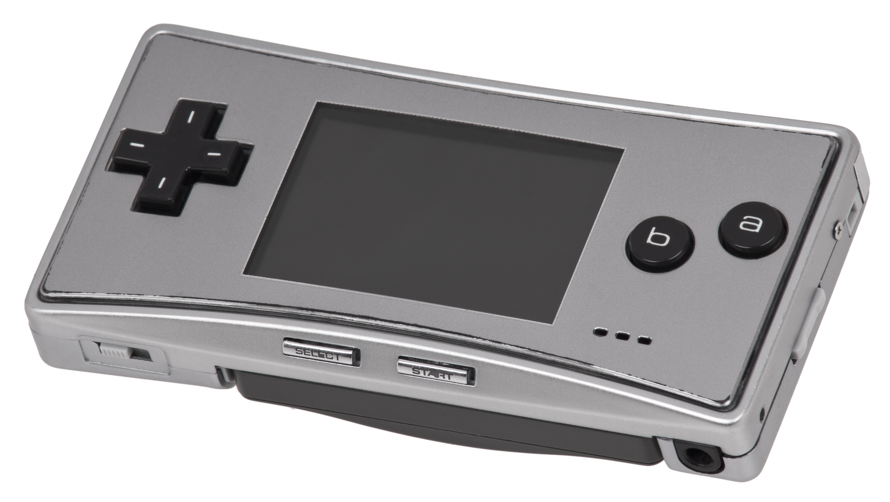
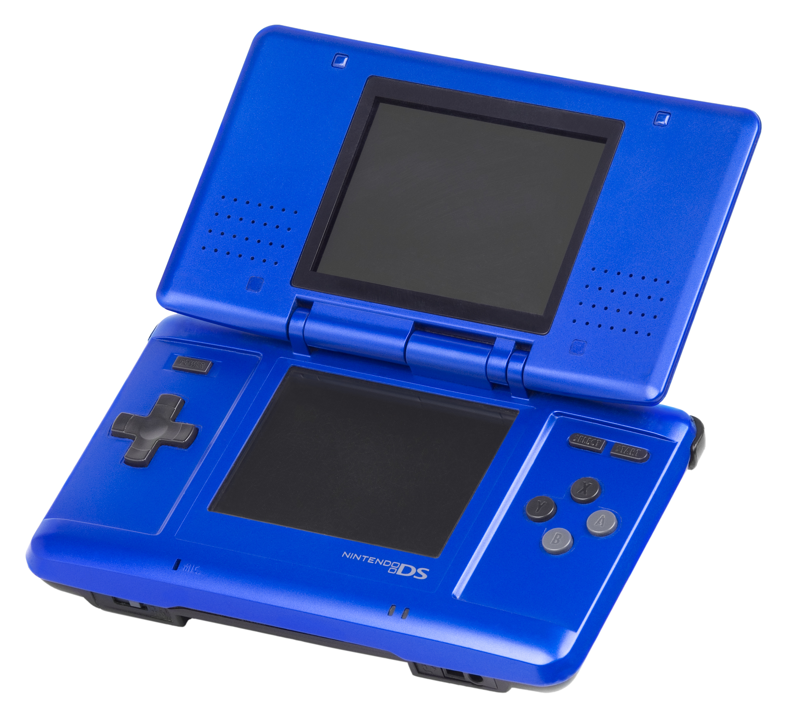

# The Game Boy Advance

It's Game Boy **Advance**, **not Advance*d*! Also note that Game Boy is two words. It's not Gameboy, Game-Boy or GameBoy: it's Game Boy (notice the space). Game Boy Advance.

## History

Chance are, you're here because you know about the Game Boy, and specifically the Game Boy Advance. Even so, there's some history that might be good to know if you're looking to start GBA homebrew development from scratch.

### Game Boy / Game Boy Color

These are the two models of classic Game Boy. These machines both use a custom made 8-bit "LR35902" CPU from Sharp that runs at \~4.19 MHz in Game Boy mode, and \~8.39 MHz in Game Boy Color mode. The CPU instruction set is a blend of 8080 and Z80.

Now this is very important: The Game Boy Advance is entirely different to both of these. The tutorial will **NOT** (and I repeat, **NOT**) help you learn how to create Game Boy or Game Boy Color games.

If these consoles are mentioned, they will be referred to as "DMG" for Game Boy, and "CGB" for Game Boy Color. These stand for "Dot Matrix Game" and "Color Game Boy", the codenames for both of these machines.

|Game Boy|Game Boy Color|
|---|---|
|||
|Photo of DMG by [Evan Amos](https://commons.wikimedia.org/wiki/User:Evan-Amos)|Photo of CGB by [Evan Amos](https://commons.wikimedia.org/wiki/User:Evan-Amos)|

### Game Boy Advance

Released in 2001, the Game Boy Advance is the successor to the Game Boy Color. Features a wider screen (240x160 pixels), two shoulder buttons (L and R) and a *completely* different architecture to past Game Boys. Game Boy hardware does exist in the Advance for backwards compatibility, but it is completely unavailable when operating in Game Boy Advance mode.

There are several revisions of the Game Boy Advance hardware:

|Model|Model ID|Code name|Release date|Notes|Photo|
|---|---|---|---|---|---|
|Game Boy Advance|AGB-001|Advance Game Boy|March 21, 2001|Original model (No light, reflective LCD)||
|Game Boy Advance SP|AGS-001|Game Boy Advance Special|February 14, 2003|Frontlight reflective LCD (with a slightly bluish hue)||
|Game Boy Player|DOL-017|-|March 21, 2003|An accessory that lets your play Game Boy games on TV via your Game Cube||
|Game Boy Advance SP (Now with a BRIGHTER backlit screen!)|AGS-101|-|September 2005|Backlight LCD (and it looks gorgeous)||
|Game Boy micro|OXY|Oxy|September 13, 2005|No DMG/CGB backwards compatibility||

(Photos by [Evan Amos](https://commons.wikimedia.org/wiki/User:Evan-Amos))

All these models of Game Boy Advance will be referred to as the Game Boy Advance, or GBA for short. Model IDs will be used when mentioning information specific to particular models.

> Non-trivia: I seem to remember reading in a magazine prior to the SP's release that it stood for "Special Project" and was intended to be a limited run design. I can find zero sources on the internet regarding this, so probably my dumb kid brain messing up the rememberings.

### Nintendo DS

Worth mentioning because there is GBA backwards compatibility (but no DMG/CGB) and there are things to note.

Released in 2004, the DS stands for "Dual Screen". There are two models of interest to us: Original Nintendo DS (codename Nitro, model ID NTR), and the 2006 revision: DS Lite (model ID USG).

||
|---|
|Photo of NTR by [Evan Amos](https://commons.wikimedia.org/wiki/User:Evan-Amos)|

Later DS models dropped GBA support, but the GBA hardware secretly lives inside them, and is even used for the GBA virtual console of the 3DS (the DS' successor, if you haven't heard of it).
