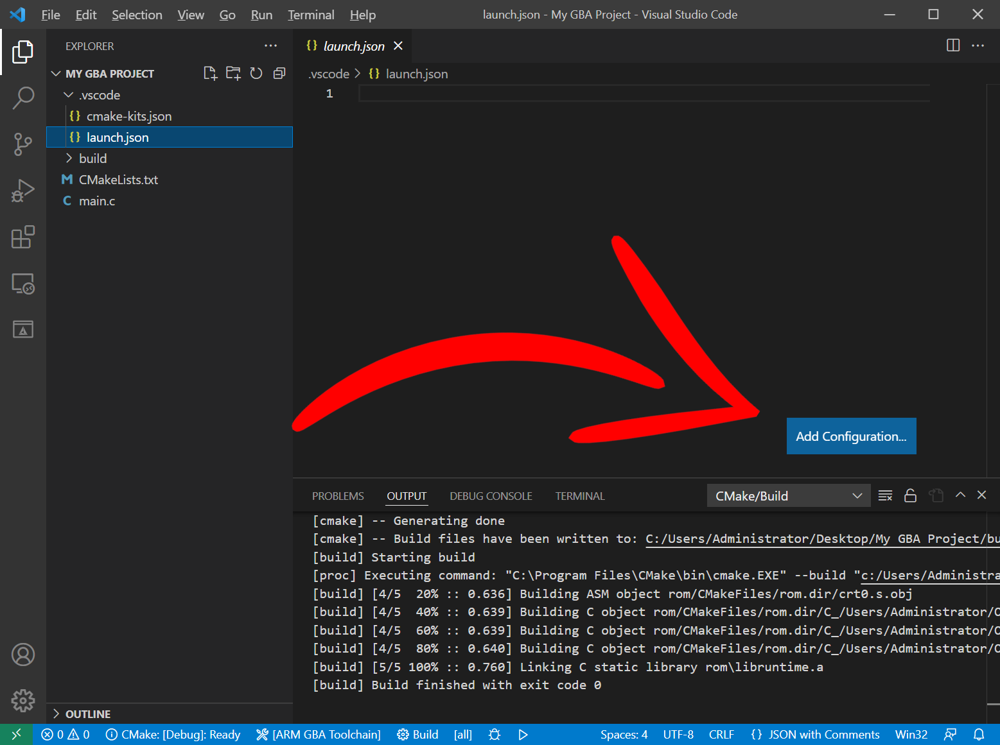
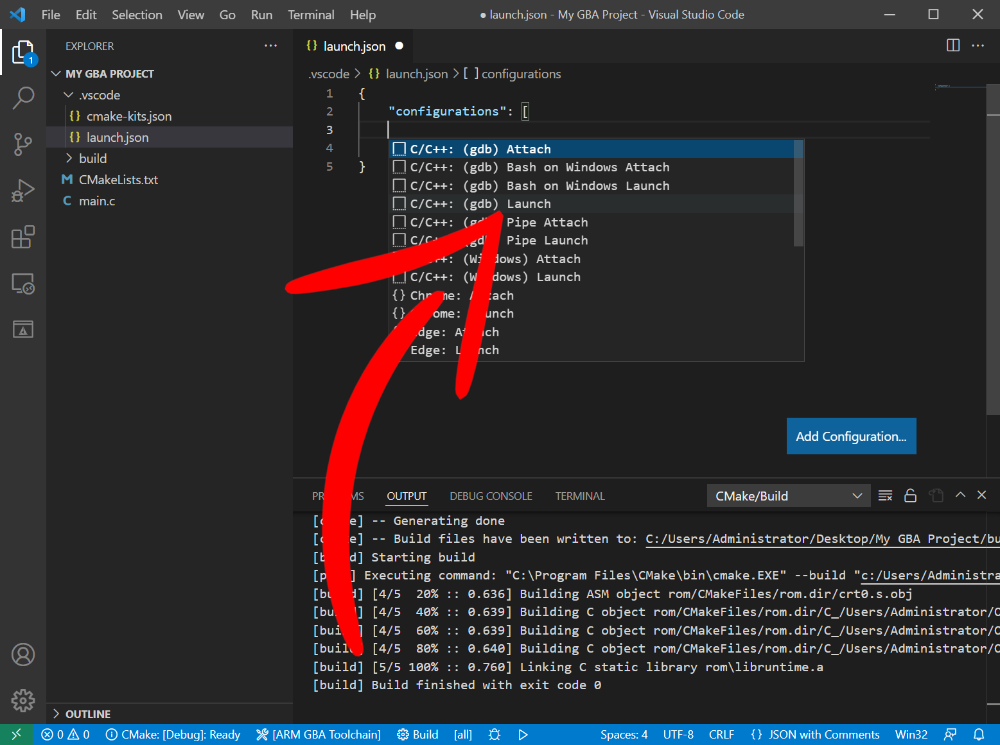
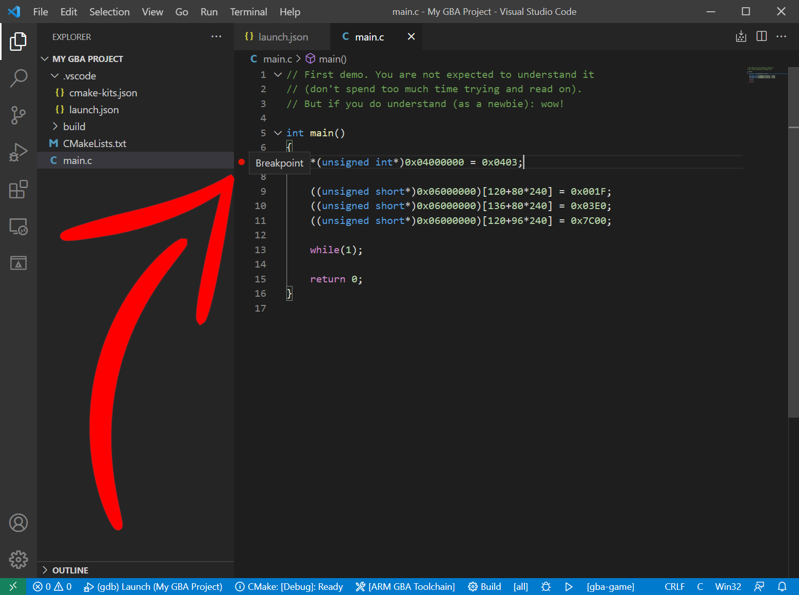
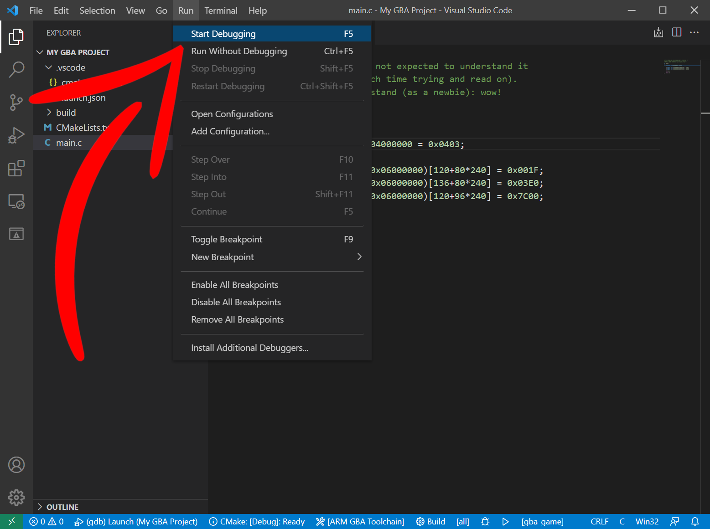
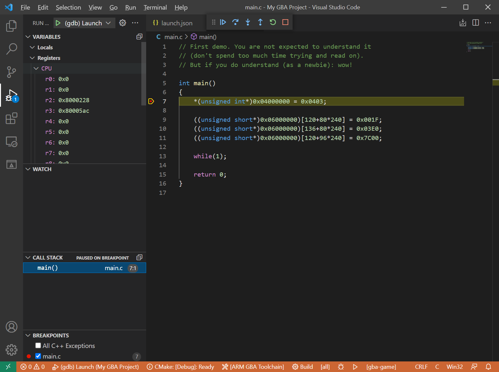
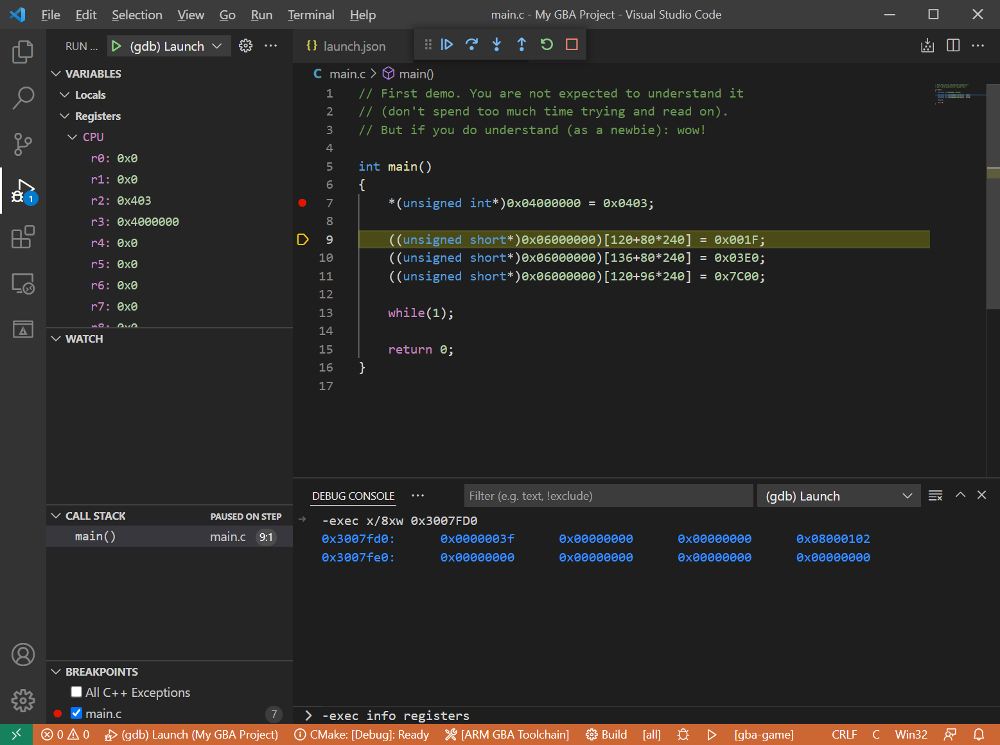

# Debugging with GDB

## Launch configuration

Create a new file called "launch.json" in the `.vscode` directory. VSCode should recognise this file and display an *Add Configuration* button.


&nbsp;

Choose the `C/C++: (gdb) Launch` option to generate the JSON for us to fill in.


&nbsp;

We should now have something like the below:

```json
{
    "configurations": [
        {
            "name": "(gdb) Launch",
            "type": "cppdbg",
            "request": "launch",
            "program": "enter program name, for example ${workspaceFolder}/a.exe",
            "args": [],
            "stopAtEntry": false,
            "cwd": "${fileDirname}",
            "environment": [],
            "externalConsole": false,
            "MIMode": "gdb",
            "miDebuggerPath": "/path/to/gdb",
            "setupCommands": [
                {
                    "description": "Enable pretty-printing for gdb",
                    "text": "-enable-pretty-printing",
                    "ignoreFailures": true
                },
                {
                    "description":  "Set Disassembly Flavor to Intel",
                    "text": "-gdb-set disassembly-flavor intel",
                    "ignoreFailures": true
                }
            ]
        }

    ]
}
```

### Launch.json Program

First, change the program field to point to our GBA ELF file.

VSCode CMake tools [comes with a few commands](https://vector-of-bool.github.io/docs/vscode-cmake-tools/settings.html) that makes writing these files a bit easier.

We can use "${command:cmake.buildDirectory}" to get the build directory of our current CMake configuration. Inside this directory is where our ELF file is built.

My ELF file is called "gba-game.elf", so my "program" field should be:
```json
    "program": "${command:cmake.buildDirectory}/gba-game.elf",
```

### Current working directory

This is the working directory of the gdb server (more on this in a bit). Set this to just the build directory (you'll see why soon):
```json
    "cwd": "${command:cmake.buildDirectory}",
```

### Debugging server address

We'll be using mGBA's fantastic built-in gdb-server for debugging. By default, this listens on port `2345`. Because we'll be running mGBA locally, we'll address it with `localhost`.

Add a field after "MIMode" called "miDebuggerServerAddress" and set its value to "localhost:2345":
```json
    "MIMode": "gdb",
    "miDebuggerServerAddress": "localhost:2345",
```
MIMode is the type of debugger we'll be using. mGBA has a gdb-server, so we'll be using gdb.

### mGBA debugging server

Where our debugger is and how we connect to it will depend on our platform. The "miDebuggerPath" and the "setupCommands" will vary, so delete these fields completely:
```json
"miDebuggerPath": "/path/to/gdb",
"setupCommands": [
    {
        "description": "Enable pretty-printing for gdb",
        "text": "-enable-pretty-printing",
        "ignoreFailures": true
    },
    {
        "description":  "Set Disassembly Flavor to Intel",
        "text": "-gdb-set disassembly-flavor intel",
        "ignoreFailures": true
    }
]
```
And let's replace these with entries for Windows, Linux, and macOS:
```json
"windows": {
    "miDebuggerPath": "",
    "setupCommands": []
},
"linux": {
    "miDebuggerPath": "",
    "setupCommands": []
},
"osx": {
    "miDebuggerPath": "",
    "setupCommands": []
}
```

#### Debugger path

gba-toolchain by default will download and install the ARM GNU toolchain to a convenient shared directory. That is where our ARM gdb client is, so we need set the "miDebuggerPath" fields to the "arm-none-eabi-gdb" path depending on our operating system.

|OS|Where|VSCode variable|
|-|-|-|
|Windows|%LOCALAPPDATA%|${env:LOCALAPPDATA}|
|Linux|Home|~/|
|macOS|Local user share|/usr/local/share/|

So fill in the "miDebuggerPath" fields with the paths:
```json
"windows": {
    "miDebuggerPath": "${env:LOCALAPPDATA}/arm-gnu-toolchain/bin/arm-none-eabi-gdb.exe",
    "setupCommands": []
},
"linux": {
    "miDebuggerPath": "~/arm-gnu-toolchain/bin/arm-none-eabi-gdb",
    "setupCommands": []
},
"osx": {
    "miDebuggerPath": "/usr/local/share/arm-gnu-toolchain/bin/arm-none-eabi-gdb",
    "setupCommands": []
}
```
If you configured gba-toolchain to instead use an ARM GNU toolchain in another directory then you will need to adjust these fields.

#### mGBA setup commands

We'll add into "setupCommands" the command to launch mGBA's gdb-server and our GBA program.

Due to a quirk in how mGBA runs and how VSCode waits for gdb-servers to connect, we have to launch mGBA as its own process so there's no deadlock between it and VSCode.

On Windows this can be done with the `start /b ""` command. On Linux and macOS you need only to end your shell command with the ampersand symbol `&`, however on macOS we can open the mGBA app in its own process with the `open -a` command.

mGBA uses the `-g` option to start its gdb-server, so we need to include that.

Here's my setup commands that I use on Windows, Linux, and macOS:

##### Windows

On my Windows machine, mGBA.exe is located at "C:/Program Files/mGBA/mGBA.exe".

```json
"windows": {
    "miDebuggerPath": "${env:LOCALAPPDATA}/arm-gnu-toolchain/bin/arm-none-eabi-gdb.exe",
    "setupCommands": [
        {
            "text": "shell start /b \"\" \"C:/Program Files/mGBA/mGBA.exe\" -g \"${command:cmake.buildDirectory}/gba-game.elf\""
        }
    ]
},
```

##### Linux

On my Linux machine, mgba-qt is located at "/usr/local/bin/mgba-qt".

```json
"linux": {
    "miDebuggerPath": "~/arm-gnu-toolchain/bin/arm-none-eabi-gdb",
    "setupCommands": [
        {
            "text": "shell \"/usr/local/bin/mgba-qt\" -g \"${command:cmake.buildDirectory}/gba-game.elf\" &"
        }
    ]
},
```

##### macOS

On my macOS machine, mGBA is located at "/Applications/mGBA.app", which can be opened with the `open -a mGBA` command.

```json
"osx": {
    "miDebuggerPath": "/usr/local/share/arm-gnu-toolchain/bin/arm-none-eabi-gdb",
    "setupCommands": [
        {
            "text": "shell open -a mGBA --args -g \"${command:cmake.buildDirectory}/gba-game.elf\""
        }
    ]
}
```

## The final launch.json

This is what my launch.json looks like after setting it up:

```json
{
    "configurations": [
        {
            "name": "(gdb) Launch",
            "type": "cppdbg",
            "request": "launch",
            "program": "${command:cmake.buildDirectory}/gba-game.elf",
            "args": [],
            "stopAtEntry": false,
            "cwd": "${command:cmake.buildDirectory}",
            "environment": [],
            "externalConsole": false,
            "MIMode": "gdb",
            "miDebuggerServerAddress": "localhost:2345",
            "windows": {
                "miDebuggerPath": "${env:LOCALAPPDATA}/arm-gnu-toolchain/bin/arm-none-eabi-gdb.exe",
                "setupCommands": [
                    {
                        "text": "shell start /b \"\" \"C:/Program Files/mGBA/mGBA.exe\" -g \"${command:cmake.buildDirectory}/gba-game.elf\""
                    }
                ]
            },
            "linux": {
                "miDebuggerPath": "~/arm-gnu-toolchain/bin/arm-none-eabi-gdb",
                "setupCommands": [
                    {
                        "text": "shell \"/usr/local/bin/mgba-qt\" -g \"${command:cmake.buildDirectory}/gba-game.elf\" &"
                    }
                ]
            },
            "osx": {
                "miDebuggerPath": "/usr/local/share/arm-gnu-toolchain/bin/arm-none-eabi-gdb",
                "setupCommands": [
                    {
                        "text": "shell open -a mGBA --args -g \"${command:cmake.buildDirectory}/gba-game.elf\""
                    }
                ]
            }
        }

    ]
}
```

Of course, if you don't need to worry about particular operating systems you can remove their entries entirely, but I have all 3 here just for your reference.

## Set a breakpoint

It's time to debug!

In our main.c, click in the margin to the left of line 7 to set a breakpoint.


&nbsp;

If everything has been set up correctly, we should now be able to use Run -> Start Debugging:


&nbsp;

And once mGBA launches, our breakpoint should be hit and VSCode will enter debugging mode:


&nbsp;

Notice how I expanded the registers view to see the CPU registers.

For information on using the VSCode debugger take a look at: https://code.visualstudio.com/docs/editor/debugging

You can also use the debugging console to send gdb commands:


&nbsp;

mGBA's memory viewer, register viewer, etc, are all available also.
