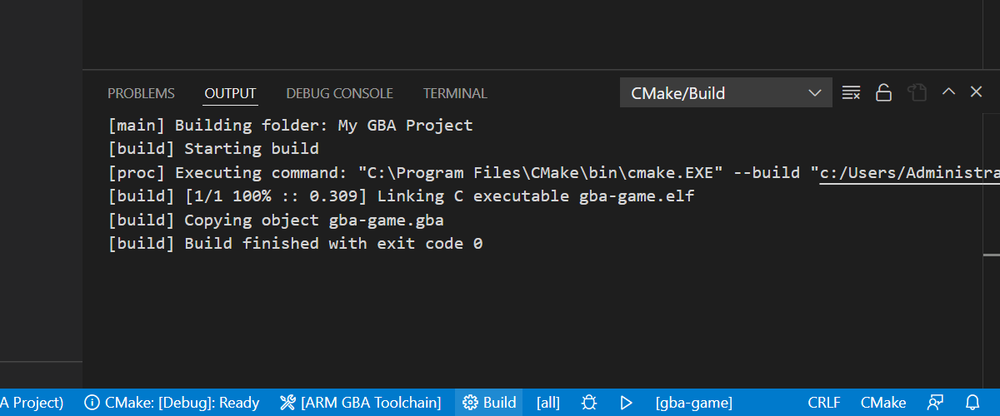
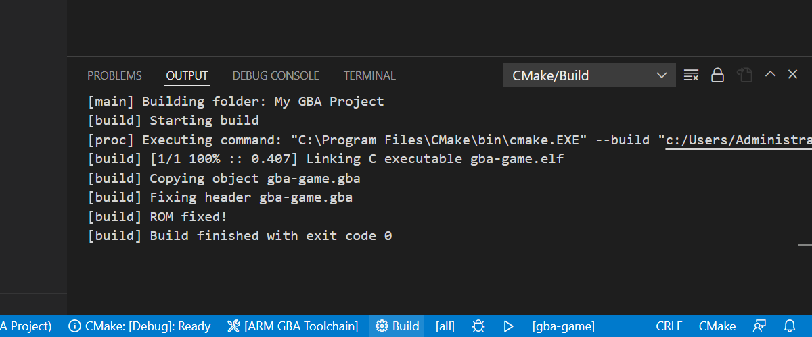

Notice that so far we've just been dealing with ELF files. ELF is great for debugging, but a real GBA needs raw-binary to execute.

# Creating a GBA binary

## objcopy

We turn our ELF into a binary by copying the various binary sections described by the ELF into a binary object. The GNU program for this is called "objcopy".

Let's go back to our CMakeLists.txt file:

```cmake
cmake_minimum_required(VERSION 3.20)

project("My GBA Project" C)

add_executable(gba-game main.c)
set_target_properties(gba-game PROPERTIES SUFFIX ".elf")

gba_add_library_subdirectory(rom)

gba_target_link_runtime_library(gba-game rom)
```

gba-toolchain provides the CMake function `gba_target_objcopy` for running objcopy on our target.

So let's add this to our CMakeLists.txt:
```cmake
gba_target_objcopy(gba-game)
```

Which should now look like:

```cmake
cmake_minimum_required(VERSION 3.20)

project("My GBA Project" C)

add_executable(gba-game main.c)
set_target_properties(gba-game PROPERTIES SUFFIX ".elf")

gba_add_library_subdirectory(rom)

gba_target_link_runtime_library(gba-game rom)

gba_target_objcopy(gba-game)
```

Now when we build we should see in the build output "Copying object gba-game.gba"


&nbsp;

And in our build folder is "gba-game.gba". Feel free to open this in mGBA, the output should be the same as the ELF program.

## Fixing the header

If at this point you tried to run this binary on actual hardware you'll realise it doesn't work (well, unless your Flashcart skips the BIOS).

This is because the GBA checks the header of the ROM to validate it's a GBA binary before execution begins. This is part of Nintendo's attempt at preventing the production of unlicensed GBA ROMs[.](https://en.wikipedia.org/wiki/Sega_v._Accolade)

gba-toolchain uses a community made tool called "gbafix" to fix ROM headers. But first, gba-toolchain needs to compile gbafix.

### Install host compiler

gba-toolchain needs a host compiler to compile its tools.

Follow the VSCode guide on checking if you have a host compiler installed: [code.visualstudio.com/docs/languages/cpp#_install-a-compiler](https://code.visualstudio.com/docs/languages/cpp#_install-a-compiler)

If you don't, then install one. That page provides MinGW-x64 as an example on Windows. On Linux and macOS it is a bit easier:

[Search for how to install GCC for your particular Linux distribution](https://www.google.com/search?q=how+to+install+GCC+on+Linux).

[Search for how to install Apple Command Line Tools](https://www.google.com/search?q=how+to+install+Apple+Command+Line+Tools).

Visual Studio on Windows works, but make sure you've installed the complete C/C++ development environment.

If you've done C/C++ development already, chances are you have a host complier and this should "just work".

### Running gbafix

gba-toolchain's `gba_target_objcopy` CMake function takes the parameter: `FIX_HEADER`. Once that argument is used, gba-toolchain will attempt to find gbafix, if it fails then it will download it and attempt to compile it. If that fails, then please re-read the previous section on installing a host compiler (you may need to delete your CMakeCache.txt file!).

Our CMakeLists.txt should now look like this:

```cmake
cmake_minimum_required(VERSION 3.20)

project("My GBA Project" C)

add_executable(gba-game main.c)
set_target_properties(gba-game PROPERTIES SUFFIX ".elf")

gba_add_library_subdirectory(rom)

gba_target_link_runtime_library(gba-game rom)

gba_target_objcopy(gba-game FIX_HEADER)
```

Delete your previous ELF and GBA ROM, and rebuild. You should see a confirmation "ROM Fixed!" in the output:


&nbsp;

Now you can take your ROM and try it out on a real GBA console.

## Additional gbafix options

The ROM header has the following additional fields:

|Field|Usage|gba-toolchain parameter|
|-|-|-|
|Title|12 character ASCII title of your game|TITLE "My Game"|
|Game Code|4 character game code in UTTD format|GAME_CODE UTTD<sup>1</sup>|
|Maker Code|2 character ASCII code representing your studio|MAKER_CODE ":)"|
|Version|Integer ROM version from 0 to 255|VERSION 100|

<sup>1</sup> UTTD format stands for Unique-code, short Title, and Desination/language.

Unique code probably had some special meaning. Short title is a two character title of your game's name (So Pac-Man would probably be "pm"), and destination/language is a single character describing the region or language of your game. P for PAL, E for English, J for Japanese, F for French, etc.

Here's an example of using this with gba-toolchain in CMakeLists.txt:

```cmake
gba_target_objcopy(gba-game FIX_HEADER
    TITLE "My Game"
    GAME_CODE 2MGE  # 2 for SRAM (see below), MG for My Game, E for English
    MAKE_CODE GT    # GT for "Gba Tutorial"
    VERSION 1       # Or perhaps we should start from version 0?
)
```

### UTTD and the Everdrive X5 Flashcart

Version 1.13 of the Everdrive X5 OS uses an ASCII number (1 to 4) in the unicode code as an easy way to identify save-type:

1. EEPROM
2. SRAM
3. FLASH-64
4. FLASH-128

For friendliness towards the X5, I recommend using this when possible!
