# gba-toolchain

This setup tutorial will cover compiling a GBA ROM with the [gba-toolchain](https://github.com/felixjones/gba-toolchain). What is the gba-toolchain? Well, it's a CMake-based toolchain written by yours truly.

You can download the repository from [github.com/felixjones/gba-toolchain](https://github.com/felixjones/gba-toolchain), or you can just download the toolchain script from [github.com/felixjones/gba-toolchain/3.0/arm-gba-toolchain.cmake](https://raw.githubusercontent.com/felixjones/gba-toolchain/3.0/arm-gba-toolchain.cmake).

Extract the repo (or save the script) to a location that you can easily reference later.    
On Windows a handy location could be your user directory at `%userprofile%`. On Linux or Mac, perhaps your `home` directory.

## CMake

CMake is the industry standard for modern C/C++ development (as of 2022, at least), and I promised that this tutorial will cover GBA development in the modern age.

CMake has a pretty handy mechanism for cross-compiling called "CMake toolchains". gba-toolchain is a CMake toolchain, but one that sets up everything you need for GBA development, including tools and libraries.

gba-toolchain requires CMake 3.20, so go ahead and [download CMake](https://cmake.org/download) if you're following along.

## Visual Studio Code

Modern IDEs tend to have good support for CMake based projects. VSCode is one of them (via the CMake plugin). Like CMake, it's cross-platform.

[Download VSCode here](https://code.visualstudio.com/). Oh and important note: **VSCode is not Visual Studio**. Cross-compiled CMake projects can work with Visual Studio, but it's both Windows-only and isn't a common use case of Visual Studio (so its support can be buggy).

Once you've got VSCode installed, click the extensions button so we can download everything needed for C/C++ devel  opment.

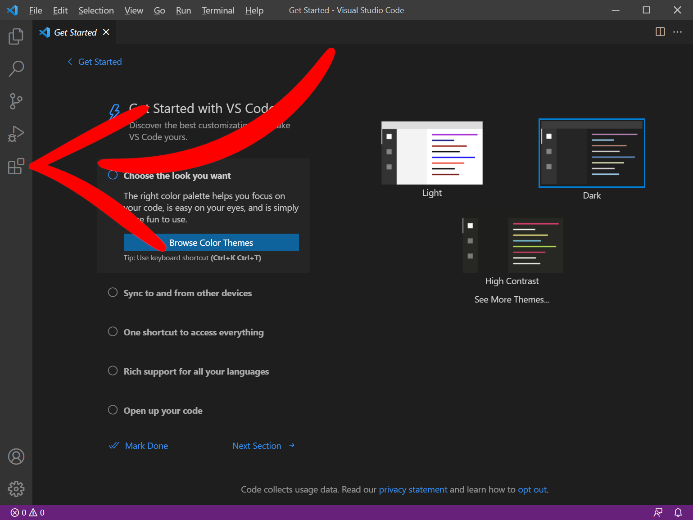

### C/C++ Development Extension

This is a Microsoft extension for VSCode that adds language support for C/C++ to VSCode, including debugging!

This also comes with CMake support (handy!).

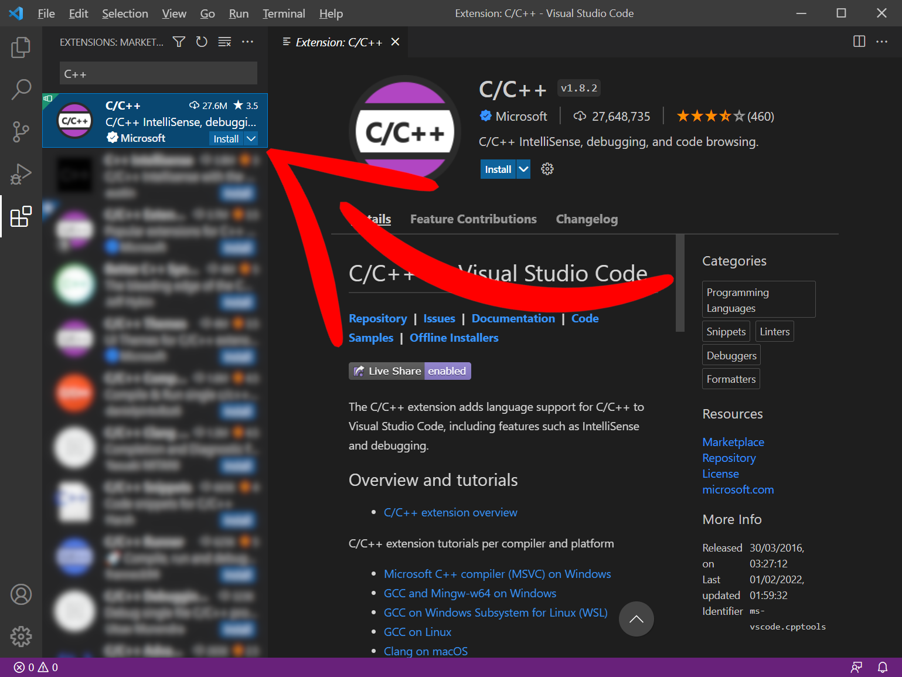

Searching "C++" in the extensions window should get you to the Microsoft C/C++ extension.

Click *Install*.

## Creating a GBA project

Make a project folder somewhere (can be anywhere) and give it a name like `My GBA Project` or something of that sort. I put my project folder on my Desktop.

Back in VSCode, go to File -> Open Folder... and find your project folder.

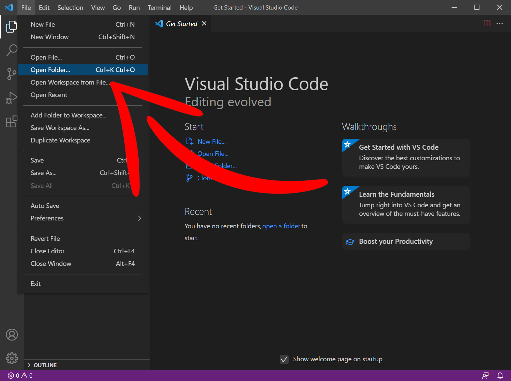

### Creating a source file

We'll start by making a C program. Create a new file in our project and name it `main.c`.

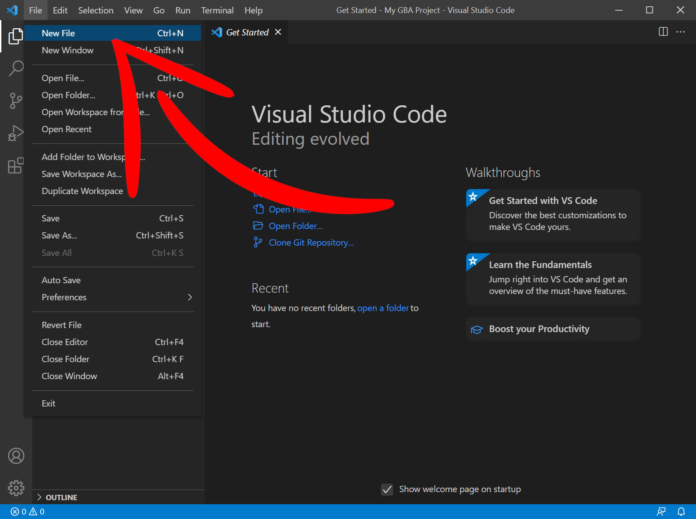
&nbsp;

With an empty file, VSCode usually asks you to select a language. If it does, go ahead and select `C`, as we'll be starting off with a C language project.

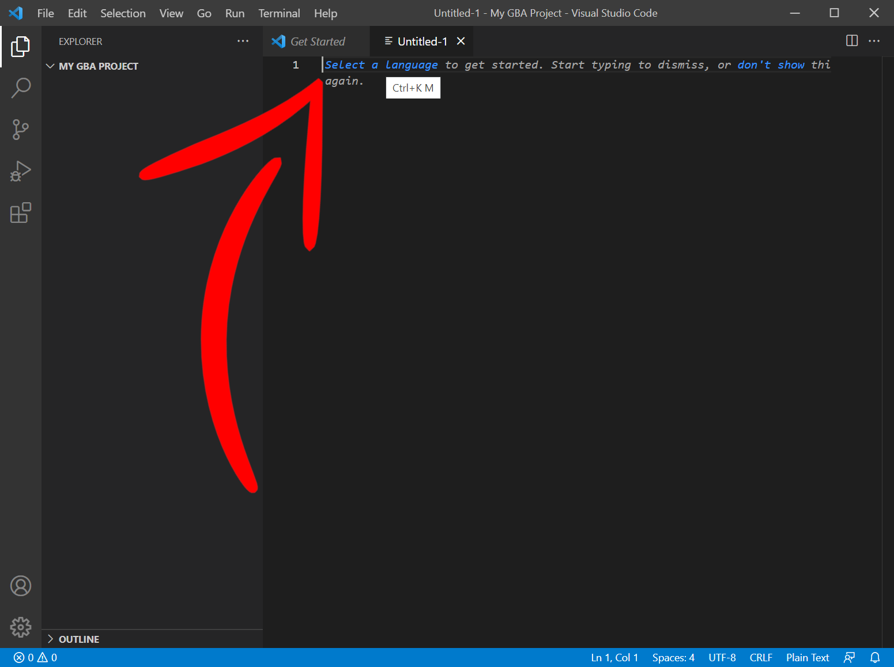
&nbsp;
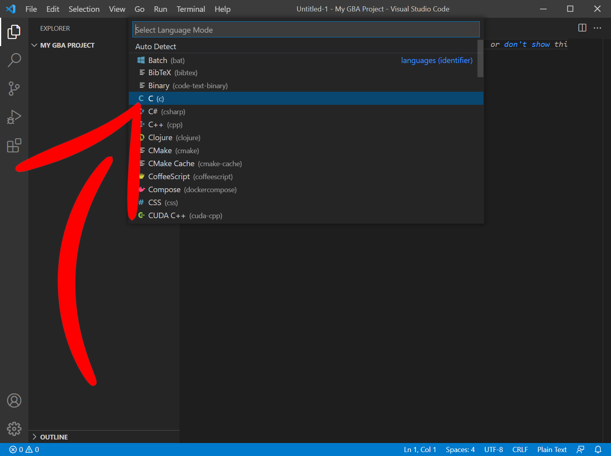
&nbsp;

VSCode may recommend some extensions for a better C development experience. Feel free to install those.

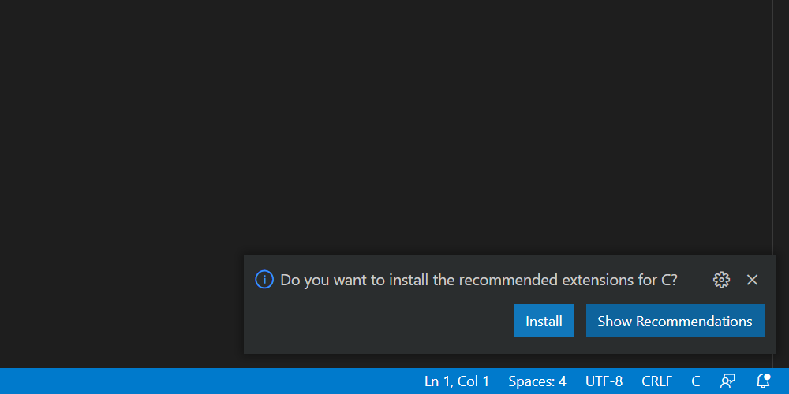
&nbsp;

Let's paste in a classic demo from the original Tonc<sup>1</sup> tutorial.

```C
// First demo. You are not expected to understand it
// (don't spend too much time trying and read on).
// But if you do understand (as a newbie): wow!

int main()
{
    *(unsigned int*)0x04000000 = 0x0403;

    ((unsigned short*)0x06000000)[120+80*240] = 0x001F;
    ((unsigned short*)0x06000000)[136+80*240] = 0x03E0;
    ((unsigned short*)0x06000000)[120+96*240] = 0x7C00;

    while(1);

    return 0;
}
```

And save this file as `main.c`.

### Defining the project

Create a new file next to `main.c` and call it `CMakeLists.txt`. You can consider this our "project" file.

gba-toolchain requires CMake 3.20, so we start off by declaring this at the top of the CMakeLists.txt

```cmake
cmake_minimum_required(VERSION 3.20)
```

We then give our project a name, and declare the programming language it will use, which is C. I named my project "My GBA Project".

```cmake
project("My GBA Project" C)
```

We'll add an executable to this project, we'll call it "gba-game" for now. We'll also be compiling this into a [.ELF](https://en.wikipedia.org/wiki/Executable_and_Linkable_Format) file at first, so we'll add ".elf" as a suffix on "my_executable".

```cmake
add_executable(gba-game main.c)
set_target_properties(gba-game PROPERTIES SUFFIX ".elf")
```

That should be enough to get things going for now. The complete CMakeLists.txt should look like:

```cmake
cmake_minimum_required(VERSION 3.20)

project("My GBA Project" C)

add_executable(gba-game main.c)
set_target_properties(gba-game PROPERTIES SUFFIX ".elf")
```

### Compiling the project

We need to tell both VSCode and CMake about gba-toolchain, otherwise it won't know about the compilers or tools we want to use.

To do so, we need to create a "kit", which is what VSCode uses to define CMake toolchains.

We need to create a configuration folder for VSCode. Click the New Folder button and name this folder ".vscode"

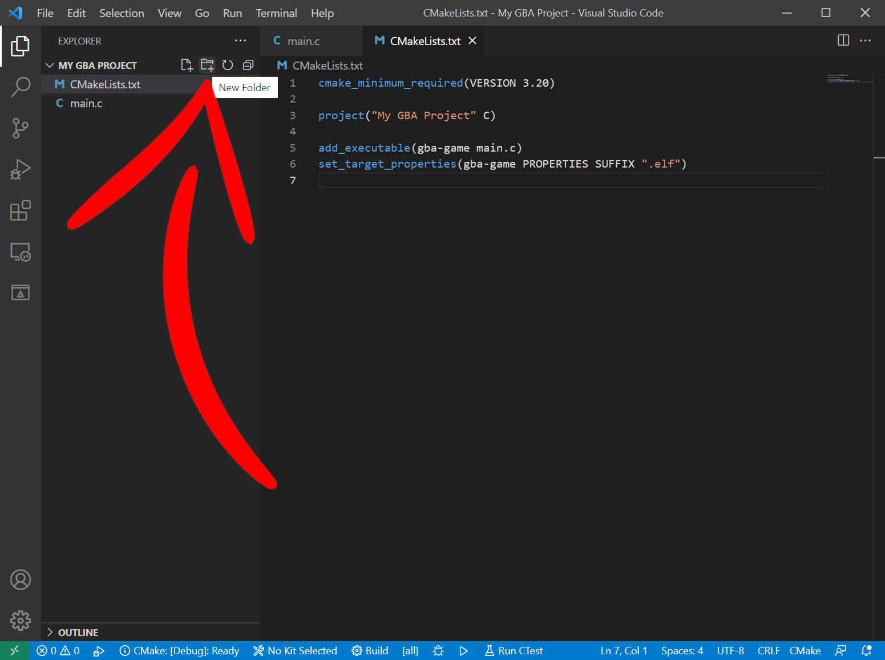

Once we have our VSCode configuration folder, add a new file to it called "cmake-kits.json".

We will define our CMake toolchain in cmake-kits.json. Give it a name, I called mine "ARM GBA Toolchain", and also add a field for the CMake toolchain file.

```json
[
    {
        "name": "ARM GBA Toolchain",
        "toolchainFile": ""
    }
]
```

Now, remember where you put the gba-toolchain when you downloaded it at the start? You should have in there a CMake toolchain file called "arm-gba-toolchain.cmake". Copy the path to this file, including the arm-gba-toolchain.cmake, and paste it into the `toolchainFile` field in the cmake-kits.json.

My toolchain is in my C: drive, so my kit looks like this:

```json
[
    {
        "name": "ARM GBA Toolchain",
        "toolchainFile": "C:\\gba-toolchain\\arm-gba-toolchain.cmake"
    }
]
```

Remember on Windows to escape the backslashes by typing two of them! `\\`

We've changed a fair bit about this project, so to wake VSCode up to our changes **close and reopen VSCode**.

I'll wait here whilst you do that. Done it? Cool.

Now when you reopen the project folder VSCode will probably ask you if you want to configure it.

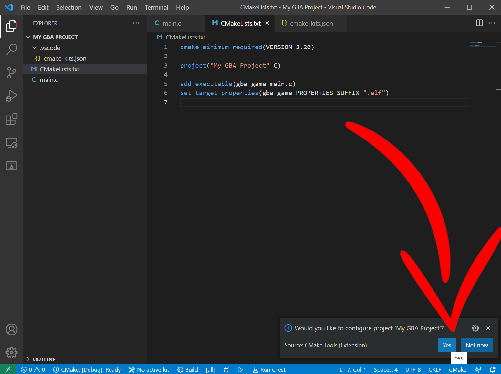
&nbsp;

Click Yes to this and VSCode should now display some output whilst it configures.

If you look at the output, you should see that it detects our kit with `[kit] Successfully loaded 1 kits from blah blah blah`

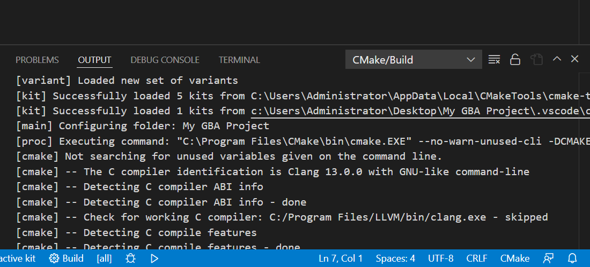
&nbsp;

We can now select our kit and compile our GBA program!

Click the little "No active kit" button at the bottom of VSCode.

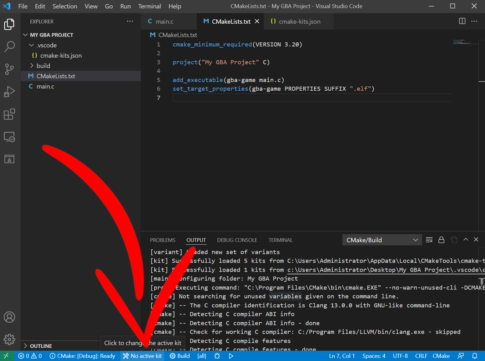
&nbsp;

And this will display a toolkit search area, where you can type in the name you gave your toolkit (so for me it is "ARM GBA Toolchain") and you can select it.

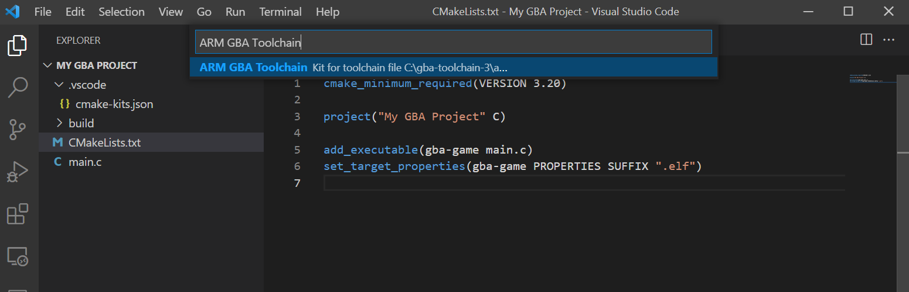
&nbsp;

So now we hit Build and...

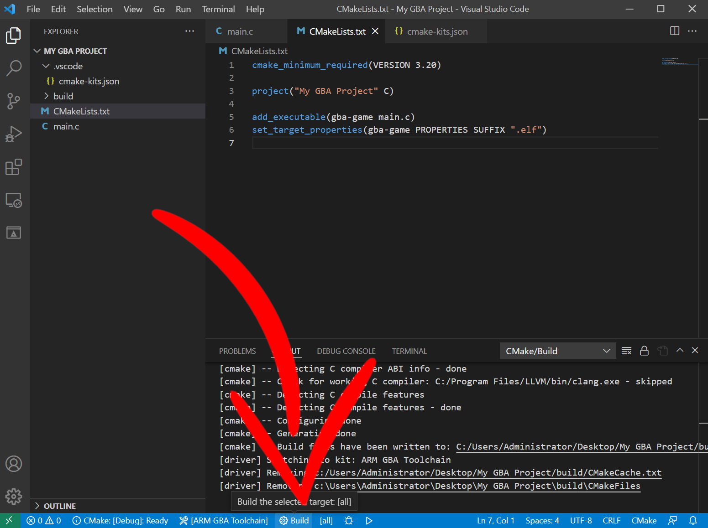
&nbsp;

Oof!

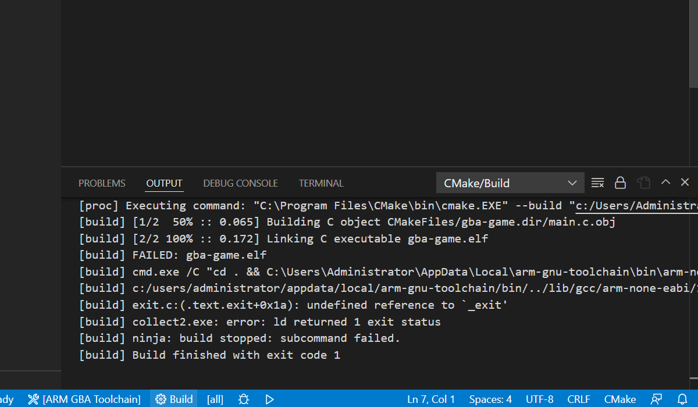
&nbsp;

Linker error.

We've managed to compile the main.c file, but we're missing a GBA implementation of the compiler runtime.

Well, now that we have our gba-toolchain kit we can do that.

### Link a GBA runtime

gba-toolchain comes with runtimes for building ROMs, Multiboot images, and e-Reader binaries.

These runtimes are provided as libraries, and gba-toolchain provides a special CMake function for adding these libraries to a project: `gba_add_library_subdirectory`

The ROM runtime (librom) is available under the name "rom". So let's add that to our CMakeLists.txt file:

```cmake
cmake_minimum_required(VERSION 3.20)

project("My GBA Project" C)

add_executable(gba-game main.c)
set_target_properties(gba-game PROPERTIES SUFFIX ".elf")

gba_add_library_subdirectory(rom)
```

We could link to librom in the normal CMake way, but there's a bit more to runtime libraries than just the library itself (linker scripts, specs files, and more).

Instead, gba-toolchain links runtimes with the function: `gba_target_link_runtime_library` which takes the name of your executable, and the name of the runtime you want to link with.

We're linking with librom so we'll use "rom".

```cmake
cmake_minimum_required(VERSION 3.20)

project("My GBA Project" C)

add_executable(gba-game main.c)
set_target_properties(gba-game PROPERTIES SUFFIX ".elf")

gba_add_library_subdirectory(rom)

gba_target_link_runtime_library(gba-game rom)
```

Now that we have a ROM runtime, let's try building again and see what we get.

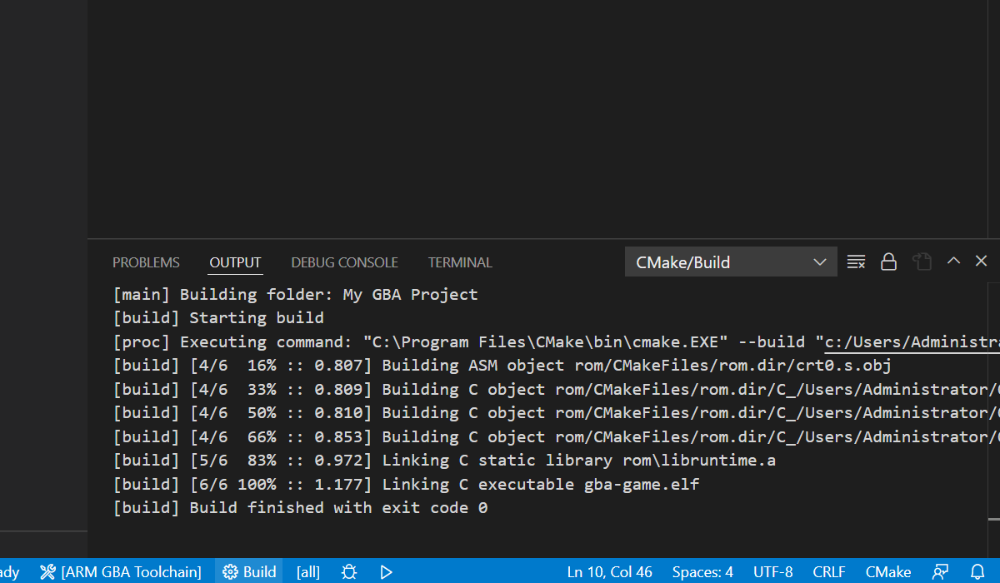
&nbsp;

Exit code 0 means success, we're managed to link our ROM runtime and produced "gba-game.elf".

The emulator [mGBA](http://mgba.io/) actually supports loading ELF files as ROMs, so let's use mGBA to run our ELF file in the `build` folder and see what we get.

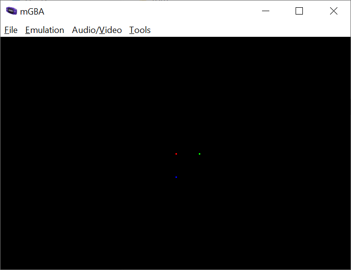
&nbsp;

And that's our first GBA demo.

***

<sup>1</sup> The [Tonc](https://www.coranac.com/tonc/text/first.htm) GBA tutorial is a legendary tutorial + development library that covers a lot of the GBA functionality.
